# 🧠 Agent Thinking Streaming

> **Real-time AI Reasoning Visualization with AWS Bedrock & Google Gemini**

[](https://www.python.org/)
[](https://www.langchain.com/)
[](https://aws.amazon.com/bedrock/)
[](https://ai.google.dev/)
[](LICENSE)

---

## 📋 Table of Contents

- [Overview](#-overview)
- [Features](#-features)
- [Architecture](#-architecture)
- [Pipeline Workflow](#-pipeline-workflow)
- [Installation](#-installation)
- [Usage](#-usage)
- [Configuration](#-configuration)
- [Technical Details](#-technical-details)
- [Examples](#-examples)
- [Troubleshooting](#-troubleshooting)
- [Author](#-author)

---

## 🎯 Overview

**Agent Thinking Streaming** is a cutting-edge implementation that visualizes AI reasoning processes in real-time. This project demonstrates how to stream and display the "thinking" process of Large Language Models (LLMs) using two major AI platforms:

- 🟠 **AWS Bedrock** (Claude 3.7 Sonnet with Extended Thinking)
- 🔴 **Google Gemini** (Gemini 2.5 Flash with Thinking Config)

The system captures and displays both the internal reasoning (thoughts) and final responses, providing unprecedented transparency into AI decision-making.

---

## ✨ Features

| Feature | Description |
|---------|-------------|
| 🔄 **Real-time Streaming** | Live streaming of AI thoughts and responses |
| 🧠 **Reasoning Visualization** | Display internal AI reasoning process |
| 🎨 **Color-coded Output** | Distinct colors for thoughts (gray) and answers (green) |
| 💾 **Memory Management** | Conversation history with LangGraph checkpointing |
| 🔌 **Dual Provider Support** | Works with both AWS Bedrock and Google Gemini |
| ⚡ **Efficient Processing** | Optimized chunk processing for minimal latency |
| 🛡️ **Error Handling** | Graceful error recovery and user-friendly messages |

---

## 🏗️ Architecture

```
┌─────────────────────────────────────────────────────────────┐
│                     USER INTERFACE                          │
│                   (Terminal/Console)                        │
└────────────────────┬────────────────────────────────────────┘
                     │
                     ▼
┌─────────────────────────────────────────────────────────────┐
│                  AGENT ORCHESTRATOR                         │
│                    (LangGraph)                              │
│  ┌──────────────────────────────────────────────────────┐  │
│  │  • Message Processing                                │  │
│  │  • State Management (MemorySaver)                    │  │
│  │  • Stream Coordination                               │  │
│  └──────────────────────────────────────────────────────┘  │
└────────────────────┬────────────────────────────────────────┘
                     │
        ┌────────────┴────────────┐
        ▼                         ▼
┌──────────────────┐    ┌──────────────────┐
│  AWS BEDROCK     │    │  GOOGLE GEMINI   │
│  Claude 3.7      │    │  Gemini 2.5      │
│  Sonnet          │    │  Flash           │
└────────┬─────────┘    └────────┬─────────┘
         │                       │
         ▼                       ▼
┌─────────────────────────────────────────┐
│      THINKING ENGINE                    │
│  • Reasoning Token Budget: 4096/1024   │
│  • Extended Thinking Mode               │
│  • Structured Output Generation         │
└────────┬────────────────────────────────┘
         │
         ▼
┌─────────────────────────────────────────┐
│      STREAM PROCESSOR                   │
│  ┌───────────────────────────────────┐ │
│  │  1. Chunk Reception               │ │
│  │  2. Content Type Detection        │ │
│  │  3. Thought/Answer Separation     │ │
│  │  4. Real-time Display             │ │
│  └───────────────────────────────────┘ │
└─────────────────────────────────────────┘
```

---

## 🔄 Pipeline Workflow

### **Bedrock Implementation Flow**

```mermaid
graph TD
    A[👤 User Input] --> B[📨 Create HumanMessage]
    B --> C[🤖 LangGraph Agent]
    C --> D[☁️ AWS Bedrock API]
    D --> E{Stream Response}
    E -->|Chunk Type| F[🧠 Reasoning Content]
    E -->|Chunk Type| G[💬 Text Content]
    F --> H[🖥️ Display Gray Thought]
    G --> I[🖥️ Display Green Answer]
    H --> J[📊 Continue Stream]
    I --> J
    J --> K{More Chunks?}
    K -->|Yes| E
    K -->|No| L[✅ Complete Response]
    L --> M[💾 Save to Memory]
    M --> A
```



### **Detailed Step-by-Step Process**

#### **Phase 1: Initialization** 🚀
```
1. Load Environment Variables
2. Initialize LLM Client (Bedrock/Gemini)
3. Configure Thinking Parameters
   ├─ Budget Tokens: 4096 (Bedrock) / 1024 (Gemini)
   ├─ Enable Extended Thinking
   └─ Set Temperature & Max Tokens
4. Create LangGraph Agent with Memory
```

#### **Phase 2: Request Processing** 📥
```
User Input
    ↓
Format as HumanMessage
    ↓
Add to Conversation Thread
    ↓
Send to Agent with Thread ID
    ↓
Agent Streams Response
```

#### **Phase 3: Stream Parsing** 🔍
```
Receive AIMessageChunk
    ↓
Check Content Type
    ├─ String? → Direct Answer
    ├─ List? → Parse Blocks
    │   ├─ reasoning_content? → Thought
    │   └─ text? → Answer
    └─ Unknown? → Skip
```

#### **Phase 4: Display Logic** 🎨
```
┌─────────────────────────────────────┐
│  THOUGHT DETECTION                  │
│  ├─ Color: Gray (\033[90m)         │
│  ├─ Prefix: "DOC: "                │
│  └─ Stream: Real-time              │
└─────────────────────────────────────┘
           ↓
┌─────────────────────────────────────┐
│  ANSWER DETECTION                   │
│  ├─ Color: Green (\033[92m)        │
│  ├─ Prefix: None                   │
│  └─ Stream: Real-time              │
└─────────────────────────────────────┘
```

---

## 📦 Installation

### **Prerequisites**

- Python 3.8 or higher
- AWS Account with Bedrock access (for Bedrock implementation)
- Google API Key (for Gemini implementation)
- pip package manager

### **Step 1: Clone Repository**

```bash
git clone https://github.com/SahiL911999/Agent-Thinking-Streaming.git
cd Agent-Thinking-Streaming
```

### **Step 2: Create Virtual Environment**

```bash
# Windows
python -m venv virenv
virenv\Scripts\activate

# Linux/Mac
python3 -m venv virenv
source virenv/bin/activate
```

### **Step 3: Install Dependencies**

```bash
pip install langchain-aws langchain-core langgraph google-genai python-dotenv
```

### **Step 4: Configure Credentials**

#### For AWS Bedrock:
```bash
# Configure AWS CLI
aws configure
# Enter your AWS Access Key ID
# Enter your AWS Secret Access Key
# Enter region: us-east-1
```

#### For Google Gemini:
```bash
# Create .env file
echo "GOOGLE_API_KEY=your_api_key_here" > .env
```

---

## 🚀 Usage

### **Running Bedrock Agent**

```bash
python bedrock_thinking.py
```

**Example Interaction:**
```
✅ Agent Started (Final Clean Version)
Input: What is the capital of France?

DOC: Let me think about this question. The user is asking about the capital city of France...

💬 You: What is the capital of France?

The capital of France is Paris. It has been the capital since 987 AD and is known for 
landmarks like the Eiffel Tower, Louvre Museum, and Notre-Dame Cathedral.
```

### **Running Gemini Agent**

```bash
python gemini_thinking.py
```

**Example Interaction:**
```
--- LANGCHAIN CUSTOM STREAMING (FINAL) ---

You: Explain quantum computing

Analyzing the question... quantum computing involves qubits... superposition principle...

Quantum computing is a revolutionary computing paradigm that uses quantum mechanical 
phenomena like superposition and entanglement to perform calculations...
```

---

## ⚙️ Configuration

### **Bedrock Configuration**

```python
llm = ChatBedrockConverse(
    model_id="us.anthropic.claude-3-7-sonnet-20250219-v1:0",
    region_name="us-east-1",
    max_tokens=8192,
    additional_model_request_fields={
        "thinking": {
            "type": "enabled",
            "budget_tokens": 4096  # Adjust thinking depth
        }
    }
)
```

### **Gemini Configuration**

```python
config = types.GenerateContentConfig(
    thinking_config=types.ThinkingConfig(
        include_thoughts=True,
        thinking_budget=1024  # Adjust thinking depth
    ),
    temperature=0  # Adjust creativity (0-1)
)
```

### **Color Customization**

| Element | ANSI Code | Color |
|---------|-----------|-------|
| User Input | `\033[94m` | Blue |
| Thoughts | `\033[90m` | Gray |
| Answer | `\033[92m` | Green |
| Error | `\033[91m` | Red |
| Reset | `\033[0m` | Default |

---

## 🔧 Technical Details

### **Key Components**

#### **1. Stream Processing (Bedrock)**
```python
def process_stream(user_input: str, thread_id: str = "1"):
    # Handles AIMessageChunk parsing
    # Separates reasoning_content from text
    # Manages color-coded output
    # Maintains conversation state
```

#### **2. Custom Chat Model (Gemini)**
```python
class GeminiReasoningChat(SimpleChatModel):
    # Implements LangChain chat interface
    # Handles thought streaming via custom writer
    # Yields ChatGenerationChunk for answers
```

#### **3. Memory Management**
```python
memory = MemorySaver()
agent = create_react_agent(model=llm, tools=[], checkpointer=memory)
# Maintains conversation history per thread_id
```

### **Stream Modes**

| Mode | Purpose | Output Type |
|------|---------|-------------|
| `messages` | Final answers | AIMessageChunk |
| `custom` | Thoughts (Gemini) | Custom dict |
| `values` | Full state | Complete state dict |

---

## 📊 Examples

### **Example 1: Mathematical Reasoning**

**Input:** "Solve: If x + 5 = 12, what is x?"

**Thought Process:**
```
DOC: This is a basic algebraic equation. I need to isolate x by subtracting 5 from both 
sides. Let me work through this step by step...
```

**Answer:**
```
To solve x + 5 = 12:
1. Subtract 5 from both sides: x + 5 - 5 = 12 - 5
2. Simplify: x = 7

Therefore, x = 7
```

### **Example 2: Complex Analysis**

**Input:** "Compare AWS Lambda vs EC2 for a microservices architecture"

**Thought Process:**
```
DOC: This requires comparing serverless vs traditional compute. I should consider factors 
like cost, scalability, maintenance, cold starts, execution limits...
```

**Answer:**
```
AWS Lambda vs EC2 for Microservices:

Lambda (Serverless):
✅ Auto-scaling, pay-per-use
✅ Zero server management
❌ 15-minute execution limit
❌ Cold start latency

EC2 (Traditional):
✅ Full control, no time limits
✅ Consistent performance
❌ Manual scaling required
❌ Pay for idle time

Recommendation: Use Lambda for event-driven, short-duration tasks; EC2 for long-running 
or resource-intensive services.
```

---

## 🐛 Troubleshooting

### **Common Issues**

#### **Issue 1: AWS Credentials Error**
```
Error: Unable to locate credentials
```
**Solution:**
```bash
aws configure
# Or set environment variables:
export AWS_ACCESS_KEY_ID=your_key
export AWS_SECRET_ACCESS_KEY=your_secret
```

#### **Issue 2: Bedrock Model Access**
```
Error: Could not access model
```
**Solution:**
- Go to AWS Bedrock Console
- Request model access for Claude 3.7 Sonnet
- Wait for approval (usually instant)

#### **Issue 3: Google API Key Error**
```
Error: API key not valid
```
**Solution:**
```bash
# Verify .env file exists and contains:
GOOGLE_API_KEY=your_actual_api_key
```

#### **Issue 4: No Thoughts Displayed**
```
Only answers showing, no reasoning
```
**Solution:**
- Verify `thinking_budget` > 0
- Check `include_thoughts=True` in config
- Ensure using correct model version

---

## 📈 Performance Metrics

| Metric | Bedrock (Claude 3.7) | Gemini (2.5 Flash) |
|--------|---------------------|-------------------|
| Avg Response Time | 2-4 seconds | 1-3 seconds |
| Thinking Tokens | Up to 4096 | Up to 1024 |
| Max Output Tokens | 8192 | Default limit |
| Streaming Latency | ~50ms per chunk | ~30ms per chunk |
| Cost per 1K tokens | $3.00 (input) / $15.00 (output) | $0.075 (input) / $0.30 (output) |

---

## 🤝 Contributing

Contributions are welcome! Please follow these steps:

1. Fork the repository
2. Create a feature branch (`git checkout -b feature/AmazingFeature`)
3. Commit your changes (`git commit -m 'Add AmazingFeature'`)
4. Push to the branch (`git push origin feature/AmazingFeature`)
5. Open a Pull Request

---

## 📄 License

This project is licensed under the MIT License - see the [LICENSE](LICENSE) file for details.

---

## 👨‍💻 Author

**Sahil Ranmbail**

- 🌐 GitHub: [@sahilranmbail](https://github.com/sahilranmbail)
- 📧 Email: sahil.ranmbail@example.com
- 💼 LinkedIn: [Sahil Ranmbail](https://linkedin.com/in/sahilranmbail)

---

## 🙏 Acknowledgments

- AWS Bedrock Team for Claude 3.7 Sonnet with Extended Thinking
- Google AI Team for Gemini 2.5 Flash with Thinking Config
- LangChain & LangGraph communities for excellent frameworks
- All contributors and users of this project

---

## 📚 Additional Resources

- [AWS Bedrock Documentation](https://docs.aws.amazon.com/bedrock/)
- [Google Gemini API Docs](https://ai.google.dev/docs)
- [LangChain Documentation](https://python.langchain.com/)
- [LangGraph Documentation](https://langchain-ai.github.io/langgraph/)

---

<div align="center">

**⭐ If you find this project useful, please consider giving it a star! ⭐**

Made with ❤️ by Sahil Ranmbail

</div>
